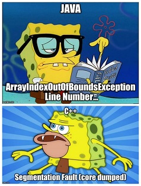

# 3081 Lab06 Using GDB and Valgrind



## What You Will Learn
1. How to add the debugging flag to your Makefile compilation targets
2. How to enter the gdb environment
3. How to use gdb commands to debug your programs
4. How to detect memory inefficiencies using Valgrind

### Retrieve class materials and merge into your personal repository

[This is the same as the previous lab.]

Navigate to your repository.

    $ cd <path_to_your_repository's_root_folder>

Pull the updated materials into your _support-code_ branch. Ensure you are in the _support-code_ branch by executing the _git status_ command.

    $ git status

The output should begin with the branch you are currently on. If it says _On branch support-code_,
you're all set. If you are still in _master_, checkout the _support-code_ branch.

    $ git checkout support-code

Check for updates from the shared-upstream repository.

    $ git pull upstream support-code

Add any updates into your own work in the _master_ branch.

    $ git checkout master
	$ git merge support-code

#### Merge conflicts?

If you encounter any errors during the pull or merge steps above, you may need to resolve a merge conflict. Git will tell you which files have merge conflicts.

It is recommended that you use a merge tool to help you handle these conflicts. The editor 'atom' has been recommended by the TAs for [resolving conflicts](https://flight-manual.atom.io/using-atom/sections/github-package/#resolve-conflicts)

### What's in Lab06?

This file:

 - README.md

Other files to be used and modified IF NECESSARY:

 - Date.h/.cc
 - Debug.h
 - Exceptions.h/.cc
 - main.cc
 - Makefile

### Debugging with GDB

1. First, build the example program with _make_.

    ````
    $ make
    ````
2. Then, run the program:
    ````
    $ ./date
    ````
See that the program quits in a Segmentation Fault. In the following steps, we will try to diagnose the problem.

3. You need to compile the code so that it can be run inside the debugger. This is a flag that can be set in the Makefile. For each of the compilation statements in the makefile, add the `-g` flag. For example:

   ````
   date: main.cc Date.o Exceptions.o
    g++ -g -Wall -o date main.cc Date.o Exceptions.o
   ````

Alternatively, you can replace the compiler flags with a Macro.

   ````
   CXXFLAGS = -Wall -g -c
   ````

And then replace the compile flags in the compile targets (_Date.o_, _Exceptions.o_) with the new Macro.

> **Note:** Wouldn't it have been nice if the original developer had used a macro? You would have only needed to add -g to the CXXFLAGS Macro definition, instead of having to do these two things.

Now, recreate the executable, with the debugging flags used this time.

    ````
	$ make clean
	$ make
	````

4. Start a debugging session on an executable file by typing _gdb <executable>_
    ````
    $ gdb date
    ````

5. Once in the debugger session (the prompt will change to (**gdb**)). Then, execute the program with _run_.
6. The program _date_ will run and crash with the following output (your output may look slightly different):
    ````
    (gdb) run
    Starting program: /home/bergx602/csci3081w/repo-bergx602/labs/lab06_gdb/date
    ... A set of Dates ...

   Program received signal SIGSEGV, Segmentation fault.
   0x0000000000401349 in doInterestingThing (yr=1998) at main.cc:27
   27        *array_len = 4;
    ````

7. Attempt to discover where (and why) in the provided code, the fault is occurring.
In this case, the line number causing the error is provided. If the location is not in the provided code, use the _gdb bt_ command (bt stands for "backtrace") to determine where the fault occurs. Type _bt_ now to see the where the execution stopped in each method:
    ````
    (gdb) bt

    #0  0x0000000000401349 in doInterestingThing (yr=1998) at main.cc:27
    #1  0x00000000004018bc in main () at main.cc:57
    ````

The backtrace shows that execution stopped in the method _doInterestingThing()_. This method was called from _main()_ on line 57 of _main.cc_.

The above backtrace indicates that the error happened on line 27 of _main.cc_. Edit the file, and look at line 27. Why is this causing an error?

Fix this error by modifying the code in _main.cc_. Recompile _date_ with _make_, and run the program again.

There are several causes of "Segmentation faults" in this program. Use _gdb_ to help to identify and fix each issue until it runs correctly (see step 7). You might find the commands _up_ and _print_ particularly useful.

8. When your program is running correctly, running the executable should output the following:
    ````
    ... A set of Dates ...
    default date is: January 1, 1900
    date d2 is: April 19, 1998
    date d3 is: April 19, 1998
    ... Now print out 4 dates in reverse time order ...
    date is: January 1, 1993
    date is: January 1, 1992
    date is: January 1, 1991
    date is: January 1, 1990
    the first date is: January 2, 1990
    ... A set of Dates ...
    default date is: January 1, 1900
    date d2 is: April 19, 1999
    date d3 is: April 19, 1999
    ... Now print out 4 dates in reverse time order ...
    date is: January 1, 1993
    date is: January 1, 1992
    date is: January 1, 1991
    date is: January 1, 1990
    the first date is: January 2, 1990

    ... Goodbye ...
    ````
9. If you're familiar with Java, you know that the jvm handles recycling the memory dynamically allocated in the heap. However, in C/C++ the memory is not recycled automatically, meaning your program is prone to memory leakage where your programs can run out memory. So, all the memory that is allocated dynamically must be recycled using  [`free(void*)`](http://www.cplusplus.com/reference/cstdlib/free/) which should be used when using `malloc`,`calloc` and other C specific memory calls, [`delete void*`](https://www.geeksforgeeks.org/g-fact-30/) which should be used when `new` is called and [`delete[] void*`](http://www.cplusplus.com/reference/new/operator%20delete[]/) which should be used when `new[]` is called. **Note: `delete/delete[]` are specific to C++ while `free` works on both C/C++.**  
With this information, you might be thinking, how can I detect possible memory leaks?  

Here's where [Valgrind](https://valgrind.org/docs/manual/quick-start.html) comes into play. The Valgrind tool suite provides a number of debugging and profiling tools that help you make your programs faster and more correct. The most popular of these tools is called Memcheck. Memcheck helps you by identifying possible memory-related issues in your C/C++ programs.

> **Note: Step 9 depends on the successful completion of step 8, so please make sure you finish step 8 before completing this step.**

To run Valgrind on your program follow the steps below:
  * Make sure valgrind is installed in your system (valgrind is by default installed on CSE machines) by typing `valgrind` in your command prompt. If you're using your own linux machine, on command prompt run `sudo apt install valgrind`.
  * Make sure you compile your code in debugging mode, just like the steps above in running gdb.
  * Then, assuming your program `program` needs two arguments `arg1 arg2`to run on the command prompt (e.g. `./program arg1 arg2`), simply run `valgrind --leak-check=yes ./program arg1 arg2`

After running valgrind, if the end of your output looks like below, then you've completed the coding part of the lab!
````
==7154== Memcheck, a memory error detector
==7154== Copyright (C) 2002-2017, and GNU GPL'd, by Julian Seward et al.
==7154== Using Valgrind-3.13.0 and LibVEX; rerun with -h for copyright info
==7154== Command: ./date
==7154==
==7154== error calling PR_SET_PTRACER, vgdb might block
 ... A set of Dates ...
default date is: January 1, 1900
date d2 is: April 19, 1998
date d3 is: April 19, 1998
 ... Now print out 4 dates in reverse time order ...
date is: January 1, 1993
date is: January 1, 1992
date is: January 1, 1991
date is: January 1, 1990
the first date is: January 2, 1990
 ... A set of Dates ...
default date is: January 1, 1900
date d2 is: April 19, 1999
date d3 is: April 19, 1999
 ... Now print out 4 dates in reverse time order ...
date is: January 1, 1993
date is: January 1, 1992
date is: January 1, 1991
date is: January 1, 1990
the first date is: January 2, 1990

... Goodbye ...
==7154==
==7154== HEAP SUMMARY:
==7154==     in use at exit: 0 bytes in 0 blocks
==7154==   total heap usage: 14 allocs, 14 frees, 73,384 bytes allocated
==7154==
==7154== All heap blocks were freed -- no leaks are possible
==7154==
==7154== For counts of detected and suppressed errors, rerun with: -v
==7154== ERROR SUMMARY: 0 errors from 0 contexts (suppressed: 0 from 0)
````
If not, don't worry: all you need to do is delete all the dynamically allocated memory using the **appropriate** deallocation methods. Here's a [link](http://cs.ecs.baylor.edu/~donahoo/tools/valgrind/messages.html) that talks about some common error messages on Valgrind Memcheck.

When your output looks like the output above you have completed the coding part of the lab!

### Pushing Results

Making sure no additional files are being pushed.

    $ git status

This should list all the files that have changed and/or are untracked. If other files are also listed as being ready to stage for commit, you may need to update your .gitignore to make sure we don't push those files(*.o,executables).

### Add Changes to Repo both Locally and on the Server

[This text is the same as in the previous lab.] You need to _stage_ all changes to the repository, which prepares those items to
be permanently part of the repository. When you _commit_ those changes, they are
saved to your local repository, which lives in your cselabs account (or your
personal computer if that is what you are working on). When you _push_ those
changes, they will be copied to the repo on the server. The difference between
_commit_ and _push_ is what separates git from centralized version control
systems.

    $ git status
    $ git add -A
    $ git commit -m "add(lab06): Adding lab06 deliverables"
    $ git push

**_What just happened?_** Double-checking the files to be staged using the _git status_ command. All of the tracked changes are staged with `git add -A`. Those staged changes were committed to your local repository and tagged with the message that follows `-m`, then pushed to the server in your remote repository.

### Reading the Feedback

Pushing to the server triggers the automated grading system. Soon your repo will
contain a feedback file, letting you know if you have passed all tests of the
assignment.

    $ git pull

THIS LAB IS COMPLETE.

Congratulations!


### References

#### unix level commands -- entered at the $ prompt:

| Command | Description |
|---|---|
| man gdb | to get help on gdb at the unix command level |
| g++ -g -o program filename.cpp | to compile & link with the debug (-g) option |
| gdb _ProgramName_ | to execute the debugger on executable _ProgramName_ |


#### Basic gdb commands -- entered after the (gdb) prompt:
| Command | Description |
|---|---|
| help | to display a list of gdb commands |
| help _command_ | to get help on a specified gdb command |
| run | to run/execute the program starting from the beginning |
| backtrace | show the current stack (which function is being executed) |
| up | move up in the backtrace stack |
| down | move down in the backtrace stack |
| continue | to resume running/executing the program |
| next | to execute the current statement and stop at the next statement |
| step | same as next, but step into a function |
| list xx | list source lines starting at line xx |
| list | to list the next source lines |
| list xx,yy | to list sources lines from line xx to line yy |
| list filename:xx | to list source lines in the specified file starting at line xx |
| quit | to quit gdb and revert to the unix command level |
| break _functionname_ | to set a breakpoint at the start of a function (set this before typing run) |
| break classname::functionname | to set a breakpoint at the start of a member function |
| break filename:xx | to set a breakpoint at line xx in the specified file |
| break xx | to set a breakpoint at line xx in the current file |
| break 1 | to set a breakpoint at the first line in the current file (declaration or executable statement) |
| info break | to list all breakpoints (including those disabled); breakpoints are numbered #1, #2, #3, etc. |
| disable xx | to disable breakpoint #xx |
| enable xx | to enable breakpoint #xx |
| print v1 | to print the value of a specified variable |
| info source | to show the name of the current source file |
| info locals | to show local variables in the current frame |
| info sources | to list the name of all source files in use |
| set variable = value | to assign a new value to a specified variable |
| (return) | to re-execute the previous gdb command; this is particularly useful if the previous gdb command was next or step |

You can also execute most gdb commands by entering only the first letter of the command.

* The original source for this list is [here](https://www.bgsu.edu/arts-and-sciences/computer-science/cs-documentation/using-the-gdb-debugger.html).

#### GDB Resources
There are many places to find additional documentation on GDB:

Command reference:   (http://www.yolinux.com/TUTORIALS/GDB-Commands.html)

Another tutorial: (http://www.cs.cmu.edu/~gilpin/tutorial/)

Search for "gdb tutorial" on the web: (http://lmgtfy.com/?q=gdb+tutorial)
