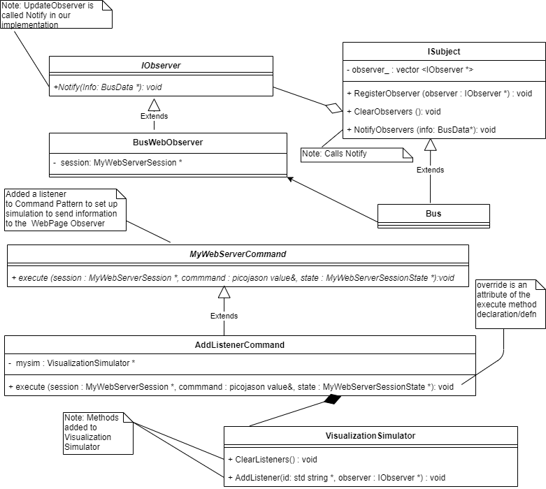
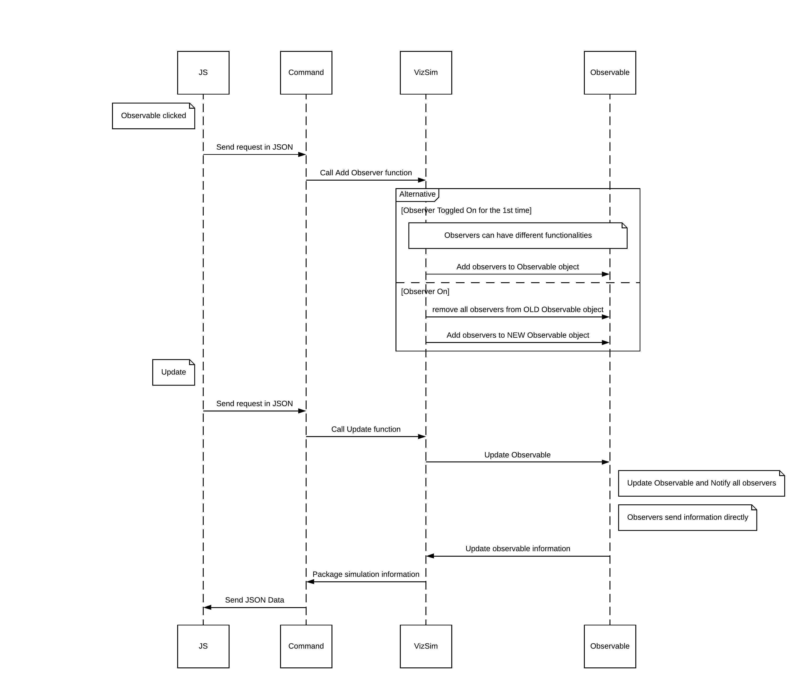

# Lab 14 - Implementing the Observer Pattern for Buses
---

The purpose of this lab is to have you implement the Observer Pattern for a single bus. As noted in the Iteration 2 requirements specification, the goal is to display relevant bus information for a single bus. The output from the observer should be at a minimum: the bus id, number of passengers, and the location of the bus (in terms of latitude and longitude). 

For this requirement we will be giving you the following items to assist you in the development:

1. A UML diagram of our implementation:  

 

2. The `BusWebObserver` code which is used to display bus information in the GUI and the `sketch.js` that will detect the mouse click on the bus. 

-------------------------------------

### What you must do:

1. Follow the documentation requirements specified in the Documentation section of the Iteration 2 Requirements.
2. Follow the the Google Style Guide for all code you create. 
3. Implement the Observer Pattern for a single bus.

### NOTE: The Observer Pattern in the Gang of Four UML has a method called Update which notifies all observers of the subject of any changes to the subject. In the Visual Transit System Simulator there is already a method called Update that used extensively throughout the simulation. Use the method NotifyObservers (as specified in the UML) instead of a method called Update in the implementation of the Observer Pattern for the bus. 

### Implementing the Observer Pattern for a single bus

Since this is a distributed architecture it is necessary to understand the sequence of steps you need to follow to implement the observer pattern for buses. The sequence diagram below shows the interaction between all of the domains of the Transit Simulation.  

 

### Deliverables:
**You will need to add the following classes to your project/src folder.**

1. Create the IObserver class using the specification in the UML.

2. Create a class called `IObservable` (this is specified in the UML by `ISubject`) using the specification in the UML.  
    > You should examine the `observer.cc` code that was presented in class to assist you in the development of the observer pattern.
3. You will need to modify the `Bus.cc` and `Bus.h` files to become a derived class of `IObservable`. *Make sure your constructors are correct.* Since the bus is the subject, it has the responsibility to update all of the observers. You will have to determine which method in the existing Bus class is the best place to execute the NotifyObservers method.

---

The sequence of steps to modify the current simulation to implement the observer pattern are as follows:

1. Add a new AddListenerCommand to `web_code/web/main.cpp`, similarly to how to you implemented the pause button:
`state.commands["listen"] = new AddListenerCommand(mySim);`

2. Once the animation has started, clicking on a bus starts executing the code used to implement the observer pattern. (`Sketch.js` performs this task and we have given you the code that performs this action.) **This file does not need to be modified.**

3. `Sketch.js` sends a message to the `my_web_server_command.cc` containing the ID of the bus that was clicked. **This file does not need to be modified.** You should examine this file since it contains several methods you might find helpful.  

4. The WebServerCommand sends the bus id to the VisualizationSimulator. **You will need to change the Visualization_Simulator.cc and Visualization_Simulation.h files to include these methods:**

    - `ClearListeners` This method is invoked if the bus is currently being observed (i.e. toggling off). It has no parameters and it removes all bus observers currently in the simulation. This is accomplished by invoking the method `ClearObservers` from the `IObservable` class.
    - `AddListener` This method is invoked if the bus has not been observed. It adds an observer to a specific Bus (using bus id) in the simulation. This is accomplished by invoking the method `RegisterObserver` from the `IObservable` class.
         

### Challenge Tasks to get ready for Iteration 3

1. Make the IObservable class generic by using C++ templates.
2. Currently the simulation outputs all observer data to the GUI. Write or change the implementation to allow the observer data to be output to the terminal instead of the GUI.

            
*Congratulations* you have implemented the observer pattern for a single bus.

## This lab is due with the final deliverable on April 10th.
