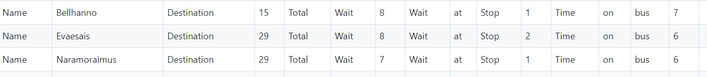
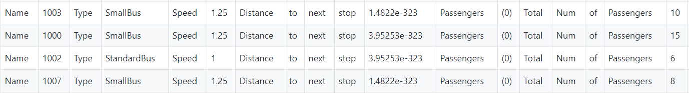
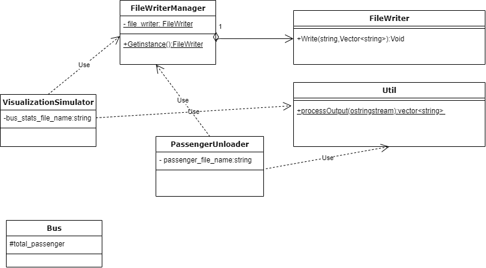

# Lab 16: Gathering Statistics and Producing Two Log Files

The purpose of this lab is to have you implement a singleton pattern to create two separate log files that will be used for statistical analysis of the simulation. Log files can be used to generate statistics from any type of application. As an example, you can use an Apache Web Server log file to determine if your system is under a distributed denial-of-service attack using statistical analysis.

Upon completing this lab, you will have fulfilled priority level 2 of Iteration 3. 

The statistics that need to be calculated are:

- the average wait times for passengers,
- the average number of passengers per bus, and
- the total number of passengers that rode the bus during the simulation.

Therefore, you will log data for passengers and buses. 

Some of the required data needed to calculate the statistics is already displayed on the terminal during the simulation, using the `Report` methods. You will need to direct some of the same information output to the terminal to two files: one file contains the passenger data, which you should name: **PassData.csv**; and one file that contains the bus data, which you should name: **BusData.csv**  The format of each file should be "csv" (comma separated value).  CSV files can be opened by a spreadsheet program, and the user can use the functionality available in the spreadsheet program to calculate the required statistics.

Examples of the log files we created in our implementation are:

Passenger Data:

 

Bus Data:

 

### Note:
**The organization of the data in your files can be different than the above examples, but the information necessary to
compute the required statistics must be present, correct, and labelled clearly so that any user familiar with the simulation can
understand it.**

In our implementation we decided to send all of the data to a `stringstream` object -- in particular, an `ostringstream` object -- instead of directly to a file. A `stringstream` object can be used in place of standard input/output. So an `ostringstream` object can be used in place of `cout` or file output. All information is stored in the `ostringstream` object. All `stringstream` objects can be converted to a `string` object by using the method `.str()`, i.e. suppose we have the C++ statements:

    ostringstream foo;
    string temp;
    
    foo << "Hello World" << endl;   // redirected the output to ostringstream object
    temp = foo.str();               // converts the contents of the ostringstream object into a string object 
    
    cout << temp;                   // outputs the string: Hello World\n
  
### What you must do:

1. Follow the documentation requirements specified in the Documentation section of the Iteration 3 Requirements.
2. Follow the the Google Style Guide for all code you create. 
3. Implement the singleton pattern to create a passenger data log file named: **PassData.csv** and a bus data log file named: **BusData.csv**
4. Use a spreadsheet to generate the required statistics.

Below is the UML we used to implement the singleton pattern to create the necessary log files. **Note: You are required to use the singleton pattern to create the log files, but you are not required to follow our implementation exactly.**

### Deliverables:

1. Add the necessary classes that you used to implement the singleton pattern to create the log files in your `project/src` folder.

     - The `util` class in our UML is used to parse the string returned by the `ostringstream` object (that contains the information from the `Report` method) and stores parsed data into a container to be able to write the data to a file. 
     - The `file_writer` class writes the parsed data from the container to a file. 
     - The `file_writer_manager` class is used to implement the singleton pattern.

2. You will need to modify the following classes in `project/src`:
     - `PassengerUnloader` -- to write the information to passenger logging file.
     - `Bus` -- need to add the appropriate variable(s) needed to produce the required statistics. The `Report` method also needs to be modified to output the new variable(s) you added. 
3. You will need to modify `VisualizationSimulator` to write the information to the bus logging file. 

### Due Date:
The content of this lab is part of your final deliverable for Iteration 3, which is due on May 1 before 11:55 PM. 

### Submission Requirements:
You will submit the 2 csv files produced by your simulation to Canvas using the BusData and PassData submission items that will posted on Canvas in the week 14 Module, due May 1st by 11:55pm. Everything else should be uploaded to your master branch on github.umn.edu as specifed in the Iteration 3 requirements specifcation document.

_Congratulations!_ You are on your way to completing one of the iteration 3 requirements!
