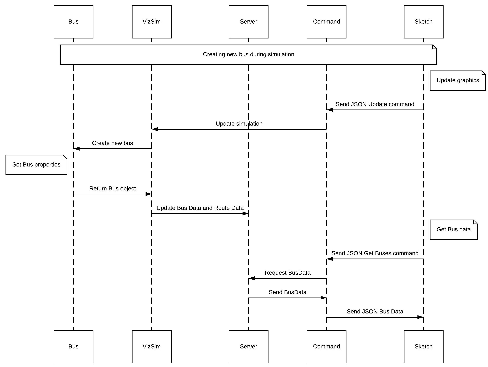

# Lab 17: Modifying Object Data using Decorators

The purpose of this lab is to have you implement a decorator pattern that dynamically modifies the behavior of an object at run time by wrapping the object in a decorator class. This technique is widely used when an object is instantiated but improvements must be made to the object as code execution progresses before it is completed. The design of the decorator allows users to modify the behavior of an individual instance of an object without impacting the behavior of other instances of the same kind. For example, a person can be wrapped in a student decorator which can be wrapped in an athlete decorator. The person is the base component on which we've applied a couple of decorators which modified the behavior of that specific person object. This example shows the power of decorators, because we can modify the behavior of just that specific person, not all objects of the person class.

Upon completing this lab, you will have fulfilled priority level 3 of Iteration 3 (coloring buses using the decorator pattern). The provided `sketch.js` code also gives you everything you need to start on priority level 4 of Iteration 3 (implementing a stop observer).

## How Bus properties are currently set and updated

In our current implementation, color is not part of the backend. Every object you see in the simulation is colored in the frontend (i.e. `web_graphics/`). Below is a sequence diagram that shows how information about the buses is passed in from the backend to the frontend.

 

Where:
- Bus -> `Bus.cc`  
- VizSim -> `visualization_simulator.cc`  
- Server -> `my_web_server.cc`  
- Command -> `my_web_server_command.cc`  
- Sketch -> `sketch.js`

## How to add color to the properties set and updated

From the sequence diagram above, we can see that we need to add color of the bus when we create a new bus in *VizSim*. Then, when we update the *BusData* in the *Server*, we would also need to update the colors of buses since *Server* is responsible of storing *BusData*. We would also need to update *Command* since it is responsible of sending *BusData* to `sketch.js`. Currently, `sketch.js` contains hardcoded colors,  so we also need to modify it to take in specific bus colors from the JSON. 
> Read the [Deliverables](#Deliverables) section to understand what files need to be updated for the front-end side to work.

## Detour: More instructions on Stop Observer

The provided `sketch.js` code modifies the GUI to help you implement both the decorator pattern and the stop observer. Therefore, here are some additional instructions on implementing the new observer.

From Iteration 3:    

      Implementing the observer pattern for two subjects will entail two AddListenerCommands, one for the bus and one for the stop.  
      In addition, these listeners need to be attached to the subject they are observing.  
      Remember to clear all previous observers before attaching the observer to its appropriate subject. 
In other words, you need to have two methods that replace `AddListener(std::string* id, IObserver* observer)` in `visualization_simulator.cc` (one for stop and one for bus). You also need to update the command pattern (and `main.cc`)  to make sure that the request from `sketch.js` is properly handled.  
> `sketch.js` we provided has a working stop observer implementation.  
[Lab 14](https://github.umn.edu/umn-csci-3081-s20/csci3081-shared-upstream/tree/support-code/labs/lab14_observer_gui) contains helpful information for this requirement.

### What you must do:

1. Follow the documentation requirements specified in the Documentation section of the Iteration 3 Requirements.
2. Follow the the Google Style Guide for all code you create. 
3. Implement the decorator pattern to modify the colors of the buses based on on the type of route the bus is currently traveling and the color intensity based on the number of passengers on the bus.
4. Implement an observer pattern to display relevant stop information for one stop.

### Deliverables

Using the files we've supplied you in this lab, modify the following necessary files to implement the decorator pattern, which are:
> Note: Some of the files below still need to be modified for the stop observer to work.

- `data_structs.h`: Currently, color is not specified on the backend, so we need to create a color struct to encapsulate different colors. We've chosen to specify colors in RGBA. You can either fill in the differences from your version of this file or completely replace it. 
     > If a different format is preferred (i.e. HEX), it would be straightforward to switch since we're encapsulating color.  
     Currently, the default color in `sketch.js` is (R,G,B,A) = (255,0,0,255) so make sure you specify a default color since `sketch.js` won't have a hardcoded color.
- `bus.cc`: Since each bus must take a color depending on the state they're in (i.e. outbound or inbound), bus data now contains a color struct, so you need to initialize that struct. In addition, the color struct must be updated when the bus data is updated.
- `my_web_server.cc`: Since we've added a color struct to bus data, we need to update the color struct when we update the bus data in `MyWebServer::UpdateBus`.
- `my_web_server_command.cc`: This file is responsible for sending the JSON packets to the frontend. You can either fill in the differences from your version of this file or completely replace it.
     > We need to change this file since coloring is only specified on the frontend, so we need to send the information about bus colors when we're sending the simulator information.
- `sketch.js`: This file is responsible for the visuals as seen from previous labs. You can either fill in the differences from your version of this file or completely replace it.
     > This file also includes the implementation of pause. 

### Due Date:
The content of this lab is part of your final deliverable for Iteration 3, which is due on May 1 before 11:55 PM. 

### Submission Requirements:
There are no additional submission requirements for this lab.

_Congratulations!_ You are on your way to completing two of the iteration 3 requirements!
